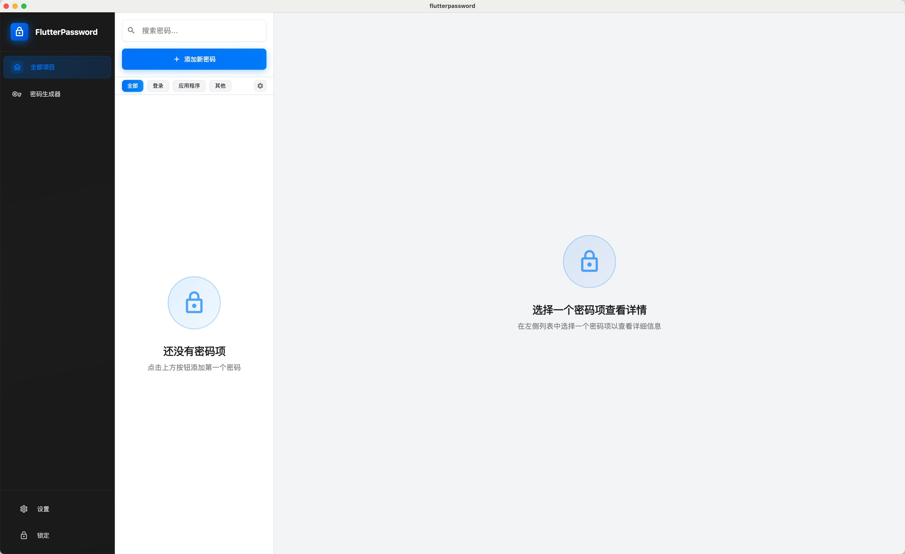
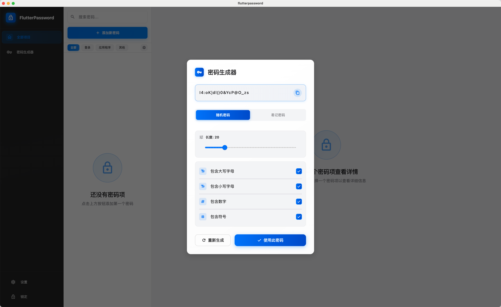
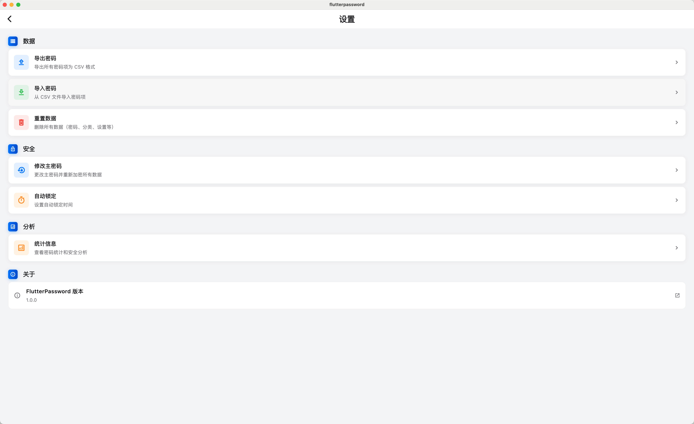

# FlutterPassword

FlutterPassword 是一个桌面密码管理器，用于安全地存储和管理本地密码。所有数据使用 AES-256 加密存储，主密码通过 PBKDF2 加密保护。

## 主要功能

- 密码管理：添加、编辑、删除密码条目，支持标题、用户名、密码、网站、备注等信息
- 分类管理：支持自定义分类，默认提供"登录"、"应用程序"、"其他"三类
- 密码生成器：生成强密码，可配置长度和字符类型
- 密码强度分析：实时评估密码强度
- 搜索和收藏：快速搜索密码条目，支持收藏常用密码
- 数据导入导出：支持 CSV 格式的导入导出
- 自动锁定：应用失去焦点时自动锁定
- 修改主密码：支持修改主密码并自动重新加密所有数据

## 应用截图








## 技术实现

- Flutter 3.38.3+ / Dart 3.0+
- Provider：状态管理
- Hive：本地数据存储
- PBKDF2 + AES-256：加密方案（主密码 PBKDF2 哈希，数据 AES-256 加密）
- Material Design 3：UI 设计

## 项目结构

```
lib/
├── main.dart                    # 应用入口
├── models/                      # 数据模型
│   └── password_item.dart       # 密码条目模型
├── screens/                     # 界面页面
│   ├── unlock_screen.dart       # 解锁/设置主密码页面
│   ├── main_screen.dart         # 主界面
│   ├── password_list_screen.dart # 密码列表
│   ├── password_detail_screen.dart # 密码详情
│   ├── password_edit_screen.dart   # 密码编辑
│   ├── category_management_screen.dart # 分类管理
│   ├── statistics_screen.dart  # 统计页面
│   └── settings_screen.dart     # 设置页面
├── services/                    # 服务层
│   ├── auth_service.dart       # 认证服务（主密码管理）
│   ├── storage_service.dart    # 存储服务（密码 CRUD）
│   ├── encryption_service.dart # 加密服务
│   ├── category_service.dart   # 分类服务
│   ├── auto_lock_service.dart  # 自动锁定服务
│   ├── clipboard_service.dart  # 剪贴板服务
│   └── session_service.dart    # 会话服务
├── widgets/                     # 可复用组件
│   ├── sidebar.dart            # 侧边栏
│   ├── glassmorphic_container.dart # 玻璃态容器
│   ├── animated_card.dart      # 动画卡片
│   ├── password_generator_dialog.dart # 密码生成器对话框
│   └── ...                     # 其他 UI 组件
├── utils/                       # 工具类
│   ├── password_generator.dart # 密码生成器
│   ├── password_strength.dart  # 密码强度分析
│   ├── password_analyzer.dart  # 密码分析器
│   └── csv_parser.dart         # CSV 解析器
└── theme/                       # 主题配置
    └── app_theme.dart          # 应用主题
```

## 开发环境要求

### 通用要求
- Flutter（stable）：建议与 CI 保持一致（当前 CI 使用 `3.38.3`）
- Dart：随 Flutter 自带（SDK >=3.0.0 <4.0.0）
- 代码生成：本项目使用 Hive 的生成代码，开发或打包前请运行：

```bash
dart run build_runner build --delete-conflicting-outputs
```

### macOS（桌面端）
- macOS：建议 macOS 13+（CI 使用 macOS 15）
- Xcode：用于编译 macOS 桌面应用（`flutter build macos`）
- CocoaPods：`flutter build macos` 会用到（Xcode 环境一般已包含/可安装）

### Windows（桌面端）
- Windows：建议 Windows 10/11
- Visual Studio 2022：安装 Desktop development with C++（MSVC、Windows SDK、CMake 工具链）
- CMake/Ninja：通常随 VS 安装；用于构建 Windows Runner（`flutter build windows`）

## 快速开始

### 安装依赖

```bash
flutter pub get
```

### 生成代码

```bash
dart run build_runner build --delete-conflicting-outputs
```

### 本地运行（macOS）

```bash
flutter run -d macos
```

### 本地运行（Windows）

```bash
flutter run -d windows
```

## 构建发布版本

### macOS（Release）

```bash
flutter build macos --release
```

产物：`build/macos/Build/Products/Release/*.app`

如需生成 DMG：

```bash
# 在 build/macos/Build/Products/Release 目录下
hdiutil create -volname "FlutterPassword" -srcfolder FlutterPassword.app -ov -format UDZO FlutterPassword-1.0.0-macos.dmg
```

### Windows（Release）

```bash
flutter build windows --release
```

产物：`build/windows/x64/runner/Release/`

如需生成安装包，使用 Inno Setup（见 `packaging/windows/FlutterPassword.iss`）。

## 应用图标

应用图标源文件位于 `public/FlutterPassword.png`（1024×1024 PNG 格式）。如果需要更新图标，请替换此文件，然后按照以下步骤生成各平台所需的图标文件。

### macOS 图标生成

macOS 需要多个尺寸的 PNG 图标文件。使用 macOS 自带的 `sips` 命令生成：

```bash
# 从源图标生成所有需要的尺寸
sips -z 16 16 public/FlutterPassword.png --out macos/Runner/Assets.xcassets/AppIcon.appiconset/app_icon_16.png
sips -z 32 32 public/FlutterPassword.png --out macos/Runner/Assets.xcassets/AppIcon.appiconset/app_icon_32.png
sips -z 64 64 public/FlutterPassword.png --out macos/Runner/Assets.xcassets/AppIcon.appiconset/app_icon_64.png
sips -z 128 128 public/FlutterPassword.png --out macos/Runner/Assets.xcassets/AppIcon.appiconset/app_icon_128.png
sips -z 256 256 public/FlutterPassword.png --out macos/Runner/Assets.xcassets/AppIcon.appiconset/app_icon_256.png
sips -z 512 512 public/FlutterPassword.png --out macos/Runner/Assets.xcassets/AppIcon.appiconset/app_icon_512.png
cp public/FlutterPassword.png macos/Runner/Assets.xcassets/AppIcon.appiconset/app_icon_1024.png
```

或者使用一键脚本：

```bash
# 使用项目提供的脚本（如果存在）
./force_rebuild_icon.sh
```

**注意**：更新图标后，建议使用 Release 模式构建以查看新图标：
```bash
flutter build macos --release
```

### Windows 图标生成

Windows 需要单个 ICO 文件，包含多个尺寸。使用 Python + PIL/Pillow 生成：

```bash
# 确保已安装 Pillow
pip install Pillow

# 生成 ICO 文件
python3 << 'EOF'
from PIL import Image
import os

source_icon = "public/FlutterPassword.png"
output_ico = "windows/runner/resources/app_icon.ico"

img = Image.open(source_icon)
sizes = [(16, 16), (32, 32), (48, 48), (64, 64), (128, 128), (256, 256)]
icons = [img.resize(size, Image.Resampling.LANCZOS) for size in sizes]

os.makedirs(os.path.dirname(output_ico), exist_ok=True)
img.save(output_ico, format='ICO', sizes=[(s[0], s[1]) for s in sizes])
print(f"✅ Windows 图标已生成: {output_ico}")
EOF
```

**验证图标**：
```bash
# 构建 Windows 应用
flutter build windows --release

# 检查生成的可执行文件图标
# 位置: build/windows/x64/runner/Release/flutterpassword.exe
```

### CI/CD 自动生成

项目已配置 GitHub Actions 工作流，在 CI/CD 构建时会自动从 `public/FlutterPassword.png` 生成图标。无需手动生成，只需更新源图标文件并推送到仓库即可。

## 安全说明

### 加密方案

- 主密码：使用 PBKDF2-SHA256 进行哈希（6000 次迭代），盐值随机生成
- 密码数据：使用 AES-256 加密，每个条目使用独立的盐值和 IV
- 密钥派生：使用 PBKDF2 从主密码派生加密密钥

### 安全建议

1. 主密码强度：建议使用至少 12 位字符的强密码
2. 定期备份：使用导出功能定期备份数据
3. 本地存储：所有数据仅存储在本地，不会上传到任何服务器
4. 自动锁定：建议启用自动锁定功能，提高安全性

### 已知限制

- 当前版本仅支持本地存储，不支持云同步
- 密码提示以明文形式存储（仅用于帮助回忆，不包含密码信息）

## 开发指南

### 代码规范

项目使用 `flutter_lints` 进行代码检查，遵循 Flutter 官方代码规范。

### 提交前检查

项目已配置 **Git 预提交钩子**，在每次 `git commit` 时会自动运行 CI 检查，确保代码质量。

#### 自动检查

当你运行 `git commit` 时，会自动执行：

1. ✅ 代码分析 (`flutter analyze --no-fatal-infos`)
2. ✅ 运行测试 (`flutter test`)
3. ✅ 代码格式检查 (`dart format --set-exit-if-changed .`)

如果检查失败，提交会被阻止，你需要修复问题后重新提交。

#### 手动运行检查

你也可以手动运行完整的 CI 检查：

```bash
./ci-check.sh
```

#### 跳过检查（不推荐）

只有在紧急情况下才应该跳过检查：

```bash
git commit --no-verify -m "紧急修复"
```

更多信息请查看 [预提交钩子说明](.github/PRE_COMMIT_HOOK.md)。

### 添加新功能

1. 在 `lib/services/` 中添加相应的服务类
2. 在 `lib/screens/` 中添加界面页面
3. 在 `lib/widgets/` 中添加可复用组件
4. 更新 `lib/models/` 中的模型（如需要）

### 测试

```bash
flutter test
```

## 贡献

欢迎提交 Issue 和 Pull Request！

详细的贡献指南请参阅 [CONTRIBUTING.md](CONTRIBUTING.md)。

### 快速开始

1. Fork 本仓库
2. 创建特性分支（`git checkout -b feature/AmazingFeature`）
3. 提交更改（`git commit -m 'Add some AmazingFeature'`）
4. 推送到分支（`git push origin feature/AmazingFeature`）
5. 开启 Pull Request

### 安全

如发现安全问题，请按照 [SECURITY.md](SECURITY.md) 中的流程报告。

## 许可证

本项目采用 MIT License，详见 [LICENSE](LICENSE) 文件。

## 相关链接

- GitHub 仓库：https://github.com/qq61538187/flutterpassword
- Flutter 官网：https://flutter.dev
- Dart 官网：https://dart.dev

## 致谢

- 感谢 [1Password](https://1password.com/) 提供的设计灵感
- 感谢所有开源库的贡献者

---

注意：本项目仅用于学习和研究目的，请勿用于生产环境。如需生产级密码管理，请使用经过安全审计的专业密码管理器。

